# Gradle详解

Gradle是当前非常“劲爆”的构建工具。本篇文章就是专为讲解Gradle而来。介绍Gradle之前，先说点题外话。

## 1 题外话

说实话，我在索尼工作的时候，就见过Gradle。但是当时我一直不知道这是什么东西。而且索尼工具组的工程师还将其和Android Studio索尼版一起推送，偶一看就更没兴趣了。为什么那个时候如此不待见Gradle呢？因为我此前一直是做ROM开发。在这个层面上，我们用make，mm或者mmm就可以了。而且，编译耗时对我们来说也不是啥痛点，因为用组内吊炸天的神机服务器完整编译索尼的image也要耗费1个小时左右。所以，那个时侯Gradle完全不是我们的菜。

现在，搞APP开发居多，编译/打包等问题立即就成痛点了。比如：

 - 一个APP有多个版本，Release版、Debug版、Test版。甚至针对不同APP Store都有不同的版本。在以前ROM的环境下，虽然可以配置Android.mk，但是需要依赖整个Android源码，而且还不能完全做到满足条件，很多事情需要手动搞。一个app如果涉及到多个开发者，手动操作必然会带来混乱。

 - library工程我们需要编译成jar包，然后发布给其他开发者使用。以前是用eclipse的export，做一堆选择。要是能自动编译成jar包就爽了。
上述问题对绝大部分APP开发者而言都不陌生，而Gradle作为一种很方便的的构建工具，可以非常轻松得解决构建过程中的各种问题。

## 2 闲言构建

构建，叫build也好，叫make也行。反正就是根据输入信息然后干一堆事情，最后得到几个产出物（Artifact）。

最最简单的构建工具就是make了。make就是根据Makefile文件中写的规则，执行对应的命令，然后得到目标产物。

日常生活中，和构建最类似的一个场景就是做菜。输入各种食材，然后按固定的工序，最后得到一盘菜。当然，做同样一道菜，由于需求不同，做出来的东西也不尽相同。比如，宫保鸡丁这道菜，回民要求不能放大油、口淡的要求少放盐和各种油、辣不怕的男女汉子们可以要求多放辣子....总之，做菜包含固定的工序，但是对于不同条件或需求，需要做不同的处理。

在Gradle爆红之前，常用的构建工具是ANT，然后又进化到Maven。ANT和Maven这两个工具其实也还算方便，现在还有很多地方在使用。但是二者都有一些缺点，所以让更懒得人觉得不是那么方便。比如，Maven编译规则是用XML来编写的。XML虽然通俗易懂，但是很难在xml中描述if{某条件成立，编译某文件}/else{编译其他文件}这样有不同条件的任务。

怎么解决？怎么解决好？对程序员而言，自然是编程解决，但是有几个小要求：

 - 这种“编程”不要搞得和程序员理解的编程那样复杂。寥寥几笔，轻轻松松把要做的事情描述出来就最好不过。所以，Gradle选择了Groovy。Groovy基于Java并拓展了Java。 Java程序员可以无缝切换到使用Groovy开发程序。Groovy说白了就是把写Java程序变得像写脚本一样简单。写完就可以执行，Groovy内部会将其编译成Java class然后启动虚拟机来执行。当然，这些底层的渣活不需要你管。

 - 除了可以用很灵活的语言来写构建规则外，Gradle另外一个特点就是它是一种DSL，即Domain Specific Language，领域相关语言。什么是DSL，说白了它是某个行业中的行话。还是不明白？徐克导演得《智取威虎山》中就有很典型的DSL使用描述，比如：
     > 土匪：蘑菇，你哪路？什么价？（什么人？到哪里去？）
     >
     > 杨子荣：哈！想啥来啥，想吃奶来了妈妈，想娘家的人，孩子他舅舅来了。（找同行）
     >
     > 杨子荣：拜见三爷！
     >
     > 土匪：天王盖地虎！（你好大的胆！敢来气你的祖宗？）
     >
     > 杨子荣：宝塔镇河妖！（要是那样，叫我从山上摔死，掉河里淹死。）
     >
     > 土匪：野鸡闷头钻，哪能上天王山！（你不是正牌的。）
     >
     > 杨子荣：地上有的是米，喂呀，有根底！（老子是正牌的，老牌的。）

Gradle中也有类似的行话，比如sourceSets代表源文件的集合等.....太多了，记不住。以后我们都会接触到这些行话。那么，对使用者而言，这些行话的好处是什么呢？这就是：

一句行话可以包含很多意思，而且在这个行当里的人一听就懂，不用解释。另外，基于行话，我们甚至可以建立一个模板，使用者只要往这个模板里填必须要填的内容，Gradle就可以非常漂亮得完成工作，得到想要的东西。

这就和现在的智能炒菜机器似的，只要选择菜谱，把食材准备好，剩下的事情就不用你操心了。吃货们对这种做菜方式肯定是以反感为主，太没有特色了。但是程序员对Gradle类似做法却热烈拥抱。

到此，大家应该明白要真正学会Gradle恐怕是离不开下面两个基础知识：

 - Groovy，由于它基于Java，所以我们仅介绍Java之外的东西。了解Groovy语言是掌握Gradle的基础。

 - Gradle作为一个工具，它的行话和它“为人处事”的原则。

## 3 Groovy介绍

Groovy是一种动态语言。这种语言比较有特点，它和Java一样，也运行于Java虚拟机中。恩？？对头，简单粗暴点儿看，你可以认为Groovy扩展了Java语言。比如，Groovy对自己的定义就是：Groovy是在 java平台上的、 具有像Python， Ruby 和 Smalltalk 语言特性的灵活动态语言， Groovy保证了这些特性像 Java语法一样被 Java开发者使用。

除了语言和Java相通外，Groovy有时候又像一种脚本语言。前文也提到过，当我执行Groovy脚本时，Groovy会先将其编译成Java类字节码，然后通过Jvm来执行这个Java类。图1展示了Java、Groovy和Jvm之间的关系。


实际上，由于Groovy Code在真正执行的时候已经变成了Java字节码，所以JVM根本不知道自己运行的是Groovy代码。

下面我们将介绍Groovy。由于此文的主要目的是Gradle，所以我们不会过多讨论Groovy中细枝末节的东西，而是把知识点集中在以后和Gradle打交道时一些常用的地方上。

### 3.1 Groovy开发环境

在学习本节的时候，最好部署一下Groovy开发环境。根据[Groovy官网](http://www.groovy-lang.org/download.html#gvm)的介绍，部署Groovy开发环境非常简单，在Ubuntu或者cygwin之类的地方：

 - curl -s get.gvmtool.net | bash
 - source "$HOME/.gvm/bin/gvm-init.sh"
 - gvm install groovy
 - 执行完最后一步，Groovy就下载并安装了。


然后，创建一个test.groovy文件，里边只有一行代码：

```groovy
println  "hello groovy"
```

执行groovy test.groovy，输出结果如图2所示：


亲们，必须要完成上面的操作啊。做完后，有什么感觉和体会？

最大的感觉可能就是groovy和shell脚本，或者python好类似。

另外，除了可以直接使用JDK之外，Groovy还有一套[GDK](http://www.groovy-lang.org/api.html)。

说实话，看了这么多家API文档，还是Google的Android API文档做得好。其页面中右上角有一个搜索栏，在里边输入一些关键字，瞬间就能列出候选类，相关文档，方便得不得了啊.....

### 3.2  一些前提知识

为了后面讲述方便，这里先介绍一些前提知识。初期接触可能有些别扭，看习惯就好了。

 - Groovy注释标记和Java一样，支持//或者/**/
 - Groovy语句可以不用分号结尾。Groovy为了尽量减少代码的输入，确实煞费苦心
 - Groovy中支持动态类型，即定义变量的时候可以不指定其类型。Groovy中，变量定义可以使用def。注意，虽然def不是必须的，但为了代码清晰，建议还是使用def关键字

    ```groovy
    def variable1 = 1//可以不使用分号结尾
    def variable2 = "I am a person"
    def int x = 1 //变量定义时，也可以直接指定类型
    ```

  -  函数定义时，参数的类型也可以不指定。比如

      ```groovy
      String testFunction(arg1,arg2){//无需指定参数类型
        ...
      }
      ```
 - 除了变量定义可以不指定类型外，Groovy中函数的返回值也可以是无类型的。比如：

    ```groovy
    //无类型的函数定义，必须使用def关键字

    def  nonReturnTypeFunc(){
         last_line   //最后一行代码的执行结果就是本函数的返回值
    }

    //如果指定了函数返回类型，则可不必加def关键字来定义函数
    String  getString(){
       return "I am a string"
    }
    ```

其实，所谓的无返回类型的函数，我估计内部都是按返回Object类型来处理的。毕竟，Groovy是基于Java的，而且最终会转成Java Code运行在JVM上

 - 函数返回值：Groovy的函数里，可以不使用return xxx来设置xxx为函数返回值。如果不使用return语句的话，则函数里最后一句代码的执行结果被设置成返回值。比如

```groovy
//下面这个函数的返回值是字符串"getSomething return value"

def getSomething(){

      "getSomething return value" //如果这是最后一行代码，则返回类型为String

      1000 //如果这是最后一行代码，则返回类型为Integer

}
```

注意，如果函数定义时候指明了返回值类型的话，函数中则必须返回正确的数据类型，否则运行时报错。如果使用了动态类型的话，你就可以返回任何类型了。

Groovy对字符串支持相当强大，充分吸收了一些脚本语言的优点：

 - 单引号''中的内容严格对应Java中的String，不对$符号进行转义

    ```groovy
    def singleQuote='I am $ dolloar'  //输出就是I am $ dolloar
    ```

 -   双引号""的内容则和脚本语言的处理有点像，如果字符中有$号的话，则它会$表达式先求值。

      ```groovy
      def doubleQuoteWithoutDollar = "I am one dollar" //输出 I am one dollar
      def x = 1
      def doubleQuoteWithDollar = "I am $x dolloar" //输出I am 1 dolloar
      ```

 - 三个引号'''xxx'''中的字符串支持随意换行，比如

    ```groovy
    def multieLines = ''' begin
        line  1
        line  2
        end '''
    ```

 - 最后，除了每行代码不用加分号外，Groovy中函数调用的时候还可以不加括号。比如：

    ```java
    println("test") ---> println "test"
    ```

注意，虽然写代码的时候，对于函数调用可以不带括号，但是Groovy经常把属性和函数调用混淆。比如

```groovy
def getSomething(){
   "hello"
}
```

```groovy
getSomething()   //如果不加括号的话，Groovy会误认为getSomething是一个变量。
```

所以，调用函数要不要带括号，我个人意见是如果这个函数是Groovy API或者Gradle API中比较常用的，比如println，就可以不带括号。否则还是带括号。Groovy自己也没有太好的办法解决这个问题，只能兵来将挡水来土掩了。

好了，了解上面一些基础知识后，我们再介绍点深入的内容。

### 3.3  Groovy中的数据类型

Groovy中的数据类型我们就介绍两种和Java不太一样的：

 - 一个是Java中的基本数据类型。
 - 另外一个是Groovy中的容器类。
 - 最后一个非常重要的是闭包。

放心，这里介绍的东西都很简单

#### 3.3.1  基本数据类型

作为动态语言，Groovy世界中的所有事物都是对象。所以，int，boolean这些Java中的基本数据类型，在Groovy代码中其实对应的是它们的包装数据类型。比如int对应为Integer，boolean对应为Boolean。比如下图中的代码执行结果：


 int实际上是Integer

 #### 3.3.2  容器类

Groovy中的容器类很简单，就三种：

 - List：链表，其底层对应Java中的List接口，一般用ArrayList作为真正的实现类。
 - Map：键-值表，其底层对应Java中的LinkedHashMap。
 - Range：范围，它其实是List的一种拓展。

对容器而言，我们最重要的是了解它们的用法。下面是一些简单的例子：

1. List类

>变量定义：List变量由[]定义，比如
>
>def aList = [5,'string',true] //List由[]定义，其元素可以是任何对象
>
>变量存取：可以直接通过索引存取，而且不用担心索引越界。如果索引超过当前链表长度，List会自动
>往该索引添加元素
>
>assert aList[1] == 'string'
>assert aList[5] == null //第6个元素为空
>aList[100] = 100  //设置第101个元素的值为10
>assert aList[100] == 100
>
>那么，aList到现在为止有多少个元素呢？
>
>println aList.size  ===>结果是101

2.  Map类

>容器变量定义
>
>变量定义：Map变量由[:]定义，比如
>
>def aMap = ['key1':'value1','key2':true]
>
>Map由[:]定义，注意其中的冒号。冒号左边是key，右边是Value。key必须是字符串，value可以是任何对象。另外，key可以用''或""包起来，也可以不用引号包起来。比如
>
>def aNewMap = [key1:"value",key2:true] //其中的key1和key2默认被
>处理成字符串"key1"和"key2"
>
>不过Key要是不使用引号包起来的话，也会带来一定混淆，比如
>
>def key1="wowo"
>def aConfusedMap=[key1:"who am i?"]
>
>aConfuseMap中的key1到底是"key1"还是变量key1的值“wowo”？显然，答案是字符串"key1"。如果要是"wowo"的话，则aConfusedMap的定义必须设置成：
>
>def aConfusedMap=[(key1):"who am i?"]
>
>Map中元素的存取更加方便，它支持多种方法：
>
>println aMap.keyName    <==这种表达方法好像key就是aMap的一个成员变量一样
>println aMap['keyName'] <==这种表达方法更传统一点
>aMap.anotherkey = "i am map"  <==为map添加新元素

3.  Range类

Range是Groovy对List的一种拓展，变量定义和大体的使用方法如下：

>def aRange = 1..5  <==Range类型的变量 由begin值+两个点+end值表示
>                      左边这个aRange包含1,2,3,4,5这5个值
>
>如果不想包含最后一个元素，则
>
>def aRangeWithoutEnd = 1..<5  <==包含1,2,3,4这4个元素
>
>println aRange.from
>
>println aRange.to

#### 3.3.4  Groovy API的一些秘笈

前面讲这些东西，主要是让大家了解Groovy的语法。实际上在coding的时候，是离不开SDK的。由于Groovy是动态语言，所以要使用它的SDK也需要掌握一些小诀窍。

Groovy的API文档位于 http://www.groovy-lang.org/api.html

以上文介绍的Range为例，我们该如何更好得使用它呢？

 - 先定位到Range类。它位于groovy.lang包中

有了API文档，你就可以放心调用其中的函数了。不过，不过，不过：我们刚才代码中用到了Range.from/to属性值，但翻看Range API文档的时候，其实并没有这两个成员变量。图4是Range的方法

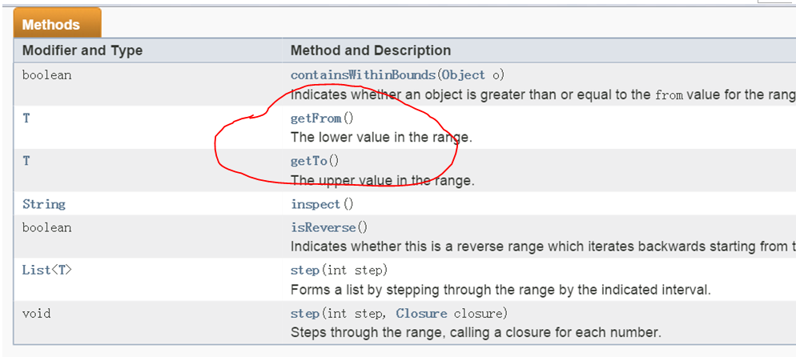

文档中并没有说明Range有from和to这两个属性，但是却有getFrom和getTo这两个函数。What happened？原来：

根据Groovy的原则，如果一个类中有名为xxyyzz这样的属性（其实就是成员变量），Groovy会自动为它添加getXxyyzz和setXxyyzz两个函数，用于获取和设置xxyyzz属性值。

注意，get和set后第一个字母是大写的

所以，当你看到Range中有getFrom和getTo这两个函数时候，就得知道潜规则下，Range有from和to这两个属性。当然，由于它们不可以被外界设置，所以没有公开setFrom和setTo函数。

### 闭包

#### 3.4.1 闭包的样子

闭包，英文叫Closure，是Groovy中非常重要的一个数据类型或者说一种概念了。闭包的历史来源，种种好处我就不说了。我们直接看怎么使用它！

闭包，是一种数据类型，它代表了一段可执行的代码。其外形如下：

```groovy
def aClosure = {//闭包是一段代码，所以需要用花括号括起来..
    String param1, int param2 ->  //这个箭头很关键。箭头前面是参数定义，箭头后面是代码
    println"this is code" //这是代码，最后一句是返回值，
   //也可以使用return，和Groovy中普通函数一样
}
```

简而言之，Closure的定义格式是：

```groovy
def xxx = {paramters -> code} //或者
def xxx = {无参数，纯code} //这种case不需要 -> 符号
```

说实话，从C/C++语言的角度看，闭包和函数指针很像。闭包定义好后，要调用它的方法就是：

闭包对象.call(参数)  或者更像函数指针调用的方法：

闭包对象(参数)

比如：

```groovy
aClosure.call("this is string",100)
//或者
aClosure("this is string", 100)
```

上面就是一个闭包的定义和使用。在闭包中，还需要注意一点：

如果闭包没定义参数的话，则隐含有一个参数，这个参数名字叫it，和this的作用类似。it代表闭包的参数。

```groovy
def greeting = { "Hello, $it!" }
assert greeting('Patrick') == 'Hello, Patrick!'
```

等同于：

```groovy
def greeting = { it -> "Hello, $it!" }
assert greeting('Patrick') == 'Hello, Patrick!'
```

但是，如果在闭包定义时，采用下面这种写法，则表示闭包没有参数！

```groovy
def noParamClosure = { -> true }
```

这个时候，我们就不能给noParamClosure传参数了！

```groovy
noParamClosure ("test")  <==报错喔！
```

#### 3.4.2  Closure使用中的注意点

##### 1.  省略圆括号

闭包在Groovy中大量使用，比如很多类都定义了一些函数，这些函数最后一个参数都是一个闭包。比如：

```groovy
public static <T> List<T> each(List<T> self, Closure closure)
```

上面这个函数表示针对List的每一个元素都会调用closure做一些处理。这里的closure，就有点回调函数的感觉。但是，在使用这个each函数的时候，我们传递一个怎样的Closure进去呢？比如：

```groovy
def iamList = [1,2,3,4,5]  //定义一个List
iamList.each{  //调用它的each，这段代码的格式看不懂了吧？each是个函数，圆括号去哪了？
      println it
}
```

上面代码有两个知识点：

 - each函数调用的圆括号不见了！原来，Groovy中，当函数的最后一个参数是闭包的话，可以省略圆括号。比如

```groovy
def  testClosure(int a1, String b1, Closure closure){
      //do something
      closure() //调用闭包
}
那么调用的时候，就可以免括号！
testClosure (4, "test", {
   println "i am in closure"
} )
```

注意，这个特点非常关键，因为以后在Gradle中经常会出现图5这样的代码：

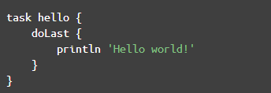

经常碰见图7这样的没有圆括号的代码。省略圆括号虽然使得代码简洁，看起来更像脚本语言，但是它这经常会让我confuse（不知道其他人是否有同感），以doLast为例，完整的代码应该按下面这种写法：

```groovy
doLast({
   println 'Hello world!'
})
```

有了圆括号，你会知道 doLast只是把一个Closure对象传了进去。很明显，它不代表这段脚本解析到doLast的时候就会调用println 'Hello world!' 。

但是把圆括号去掉后，就感觉好像println 'Hello world!'立即就会被调用一样！

##### 2.  如何确定Closure的参数

另外一个比较让人头疼的地方是，Closure的参数该怎么搞？还是刚才的each函数：

```groovy
public static <T> List<T> each(List<T> self, Closure closure)
```

如何使用它呢？比如：

```groovy
def iamList = [1,2,3,4,5]  //定义一个List变量
iamList.each{  //调用它的each函数，只要传入一个Closure就可以了。
  println it
}
```

看起来很轻松，其实：

对于each所需要的Closure，它的参数是什么？有多少个参数？返回值是什么？
我们能写成下面这样吗？

```groovy
iamList.each{String name,int x ->
  return x
}  //运行的时候肯定报错！
```

所以，Closure虽然很方便，但是它一定会和使用它的上下文有极强的关联。要不，作为类似回调这样的东西，我如何知道调用者传递什么参数给Closure呢？

此问题如何破解？只能通过查询API文档才能了解上下文语义。比如下图6：


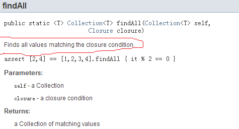

上图中：

 - each函数说明中，将给指定的closure传递Set中的每一个item。所以，closure的参数只有一个。
 - findAll中，绝对抓瞎了。一个是没说明往Closure里传什么。另外没说明Closure的返回值是什么.....。

对Map的findAll而言，Closure可以有两个参数。findAll会将Key和Value分别传进去。并且，Closure返回true，表示该元素是自己想要的。返回false表示该元素不是自己要找的。示意代码如图8所示：

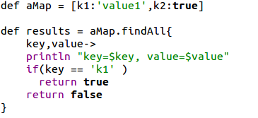

Closure的使用有点坑，很大程度上依赖于你对API的熟悉程度，所以最初阶段，SDK查询是少不了的。

### 3.5  脚本类、文件I/O和XML操作

最后，我们来看一下Groovy中比较高级的用法。

#### 3.5.1  脚本类

##### 1.  脚本中import其他类

Groovy中可以像Java那样写package，然后写类。比如在文件夹com/cmbc/groovy/目录中放一个文件，叫Test.groovy，如图10所示：

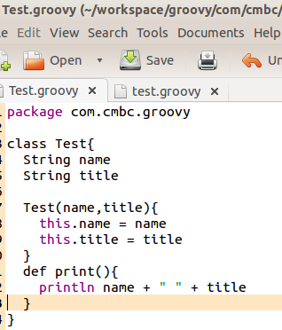

你看，图9中的Test.groovy和Java类就很相似了。当然，如果不声明public/private等访问权限的话，Groovy中类及其变量默认都是public的。

现在，我们在测试的根目录下建立一个test.groovy文件。其代码如下所示：

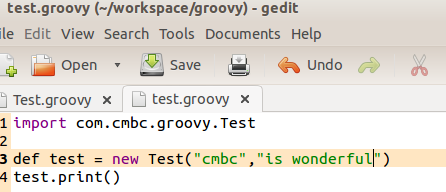

你看，test.groovy先import了com.cmbc.groovy.Test类，然后创建了一个Test类型的对象，接着调用它的print函数。

这两个groovy文件的目录结构如图11所示：


在groovy中，系统自带会加载当前目录/子目录下的xxx.groovy文件。所以，当执行groovy test.groovy的时候，test.groovy import的Test类能被自动搜索并加载到。

##### 2.  脚本到底是什么

Java中，我们最熟悉的是类。但是我们在Java的一个源码文件中，不能不写class（interface或者其他....），而Groovy可以像写脚本一样，把要做的事情都写在xxx.groovy中，而且可以通过groovy xxx.groovy直接执行这个脚本。这到底是怎么搞的？

既然是基于Java的，Groovy会先把xxx.groovy中的内容转换成一个Java类。比如：

test.groovy的代码是：

```groovy
println 'Groovy world!'
```

Groovy把它转换成这样的Java类：

执行 groovyc -d classes test.groovy

groovyc是groovy的编译命令，-d classes用于将编译得到的class文件拷贝到classes文件夹下

图13是test.groovy脚本转换得到的java class。用jd-gui反编译它的代码：

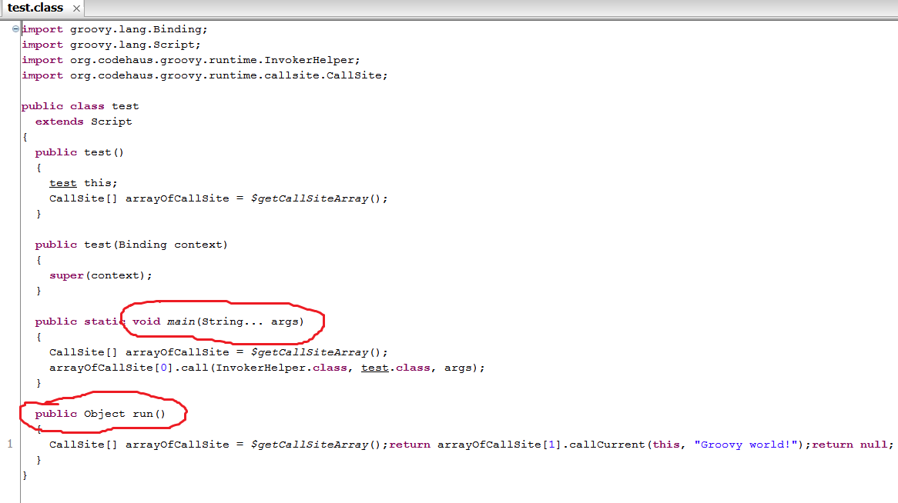

图12中：

 - test.groovy被转换成了一个test类，它从script派生。
 - 每一个脚本都会生成一个static main函数。这样，当我们groovy test.groovy的时候，其实就是用java去执行这个main函数
 - 脚本中的所有代码都会放到run函数中。比如，println 'Groovy world'，这句代码实际上是包含在run函数里的。
 - 如果脚本中定义了函数，则函数会被定义在test类中。

groovyc是一个比较好的命令，读者要掌握它的用法。然后利用jd-gui来查看对应class的Java源码。

##### 3.  脚本中的变量和作用域

前面说了，xxx.groovy只要不是和Java那样的class，那么它就是一个脚本。而且脚本的代码其实都会被放到run函数中去执行。那么，在Groovy的脚本中，很重要的一点就是脚本中定义的变量和它的作用域。举例：

```groovy
def x = 1 <==注意，这个x有def（或者指明类型，比如 int x = 1）
def printx(){
   println x
}
```

printx()  <==报错，说x找不到

为什么？继续来看反编译后的class文件。

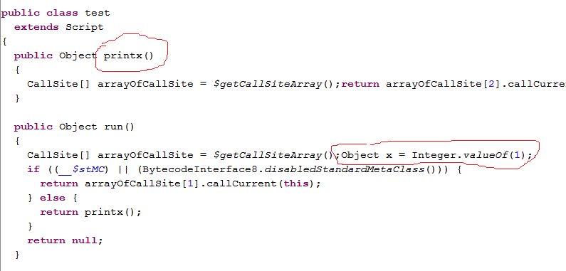

图13中：

printx被定义成test类的成员函数

def x = 1，这句话是在run中创建的。所以，x=1从代码上看好像是在整个脚本中定义的，但实际上printx访问不了它。printx是test成员函数，除非x也被定义成test的成员函数，否则printx不能访问它。
那么，如何使得printx能访问x呢？很简单，定义的时候不要加类型和def。即：

```groovy
x = 1  <==注意，去掉def或者类型
def printx(){
   println x
}
printx()  <==OK
```

这次Java源码又变成什么样了呢？

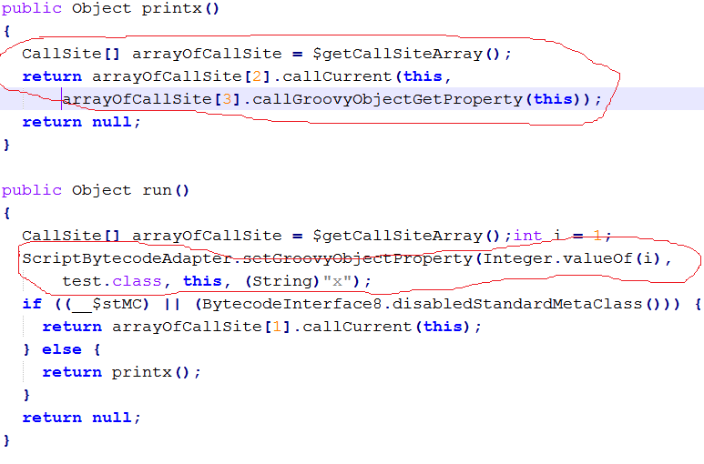

图14中，x也没有被定义成test的成员函数，而是在run的执行过程中，将x作为一个属性添加到test实例对象中了。然后在printx中，先获取这个属性。

注意，Groovy的文档说 x = 1这种定义将使得x变成test的成员变量，但从反编译情况看，这是不对的.....

虽然printx可以访问x变量了，但是假如有其他脚本却无法访问x变量。因为它不是test的成员变量。

比如，我在测试目录下创建一个新的名为test1.groovy。这个test1将访问test.groovy中定义的printx函数：


这种方法使得我们可以将代码分成模块来编写，比如将公共的功能放到test.groovy中，然后使用公共功能的代码放到test1.groovy中。

执行groovy test1.groovy，报错。说x找不到。这是因为x是在test的run函数动态加进去的。怎么办？

```groovy
import groovy.transform.Field;   //必须要先import
@Field x = 1  <==在x前面加上@Field标注，这样，x就彻彻底底是test的成员变量了。
```

查看编译后的test.class文件，得到：

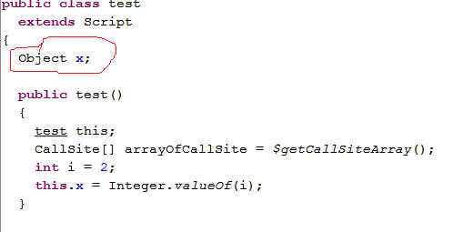

这个时候，test.groovy中的x就成了test类的成员函数了。如此，我们可以在script中定义那些需要输出给外部脚本或类使用的变量了！

##### 3.5.2  文件I/O操作

本节介绍下Groovy的文件I/O操作。直接来看例子吧，虽然比Java看起来简单，但要理解起来其实比较难。尤其是当你要自己查SDK并编写代码的时候。

整体说来，Groovy的I/O操作是在原有Java I/O操作上进行了更为简单方便的封装，并且使用Closure来简化代码编写。主要封装了如下一些了类：


######  1.  读文件

Groovy中，文件读操作简单到令人发指：

def targetFile = new File(文件名)  <==File对象还是要创建的。

然后打开 http://docs.groovy-lang.org/latest/html/groovy-jdk/java/io/File.html

看看Groovy定义的API：

 1. 读该文件中的每一行：eachLine的唯一参数是一个Closure。Closure的参数是文件每一行的内容，其内部实现肯定是Groovy打开这个文件，然后读取文件的一行，然后调用Closure...

    ```groovy
    targetFile.eachLine{
      StringoneLine ->
       printlnoneLine
      <==是不是令人发指？？！
    ```
    注意前面提到的getter和setter函数，这里可以直接使用targetFile.bytes    //....

 2. 直接得到文件内容

      ```groovy
      targetFile.getBytes()  <==文件内容一次性读出，返回类型为byte[]
      ```

 3. 使用InputStream.InputStream的SDK在 http://docs.groovy-lang.org/latest/html/groovy-jdk/java/io/InputStream.html

    ```groovy
    def ism =  targetFile.newInputStream()
    //操作ism，最后记得关掉
    ism.close
    ```

 4. 使用闭包操作inputStream，以后在Gradle里会常看到这种搞法

    ```groovy
    targetFile.withInputStream{ ism ->
       操作ism. 不用close。Groovy会自动替你close
    }
    ```

确实够简单，令人发指。我当年死活也没找到withInputStream是个啥意思。所以，请各位开发者牢记Groovy I/O操作相关类的SDK地址：

 - java.io.File: http://docs.groovy-lang.org/latest/html/groovy-jdk/java/io/File.html
 - java.io.InputStream: http://docs.groovy-lang.org/latest/html/groovy-jdk/java/io/InputStream.html
 - java.io.OutputStream: http://docs.groovy-lang.org/latest/html/groovy-jdk/java/io/OutputStream.html
 - java.io.Reader: http://docs.groovy-lang.org/latest/html/groovy-jdk/java/io/Reader.html
 - java.io.Writer: http://docs.groovy-lang.org/latest/html/groovy-jdk/java/io/Writer.html
 - java.nio.file.Path: http://docs.groovy-lang.org/latest/html/groovy-jdk/java/nio/file/Path.html

##### 2.  写文件

和读文件差不多。不再啰嗦。这里给个例子，告诉大家如何copy文件。

```groovy
def srcFile = new File(源文件名)
def targetFile = new File(目标文件名)
targetFile.withOutputStream{ os->
  srcFile.withInputStream{ ins->
      os << ins   //利用OutputStream的<<操作符重载，完成从inputstream到OutputStream
       //的输出
   }
}
```

关于OutputStream的<<操作符重载，查看SDK文档后可知：

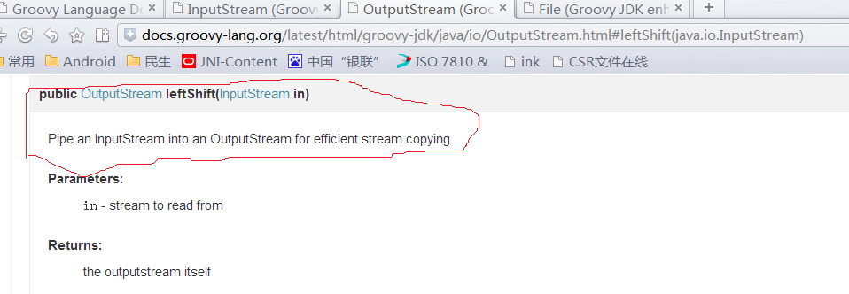

 再一次向极致简单致敬。但是，SDK恐怕是离不开手了...

 ##### 3.5.3  XML操作

 除了I/O异常简单之外，Groovy中的XML操作也极致得很。Groovy中，XML的解析提供了和XPath类似的方法，名为GPath。这是一个类，提供相应API。关于XPath，请看[Wiki](https://en.wikipedia.org/wiki/XPath)。

GPath功能包括：给个例子好了，来自Groovy官方文档。

test.xml文件：

```xml
<response version-api="2.0">
       <value>
           <books>
               <book available="20" id="1">
                   <title>Don Xijote</title>
                   <author id="1">Manuel De Cervantes</author>
               </book>
               <book available="14" id="2">
                   <title>Catcher in the Rye</title>
                  <author id="2">JD Salinger</author>
              </book>
              <book available="13" id="3">
                  <title>Alice in Wonderland</title>
                  <author id="3">Lewis Carroll</author>
              </book>
              <book available="5" id="4">
                  <title>Don Xijote</title>
                  <author id="4">Manuel De Cervantes</author>
              </book>
           </books>
      </value>
   </response>
```

现在来看怎么玩转GPath：

```groovy
//第一步，创建XmlSlurper类
def xparser = new XmlSlurper()
def targetFile = new File("test.xml")
//轰轰的GPath出场
GPathResult gpathResult =xparser.parse(targetFile)

//开始玩test.xml。现在我要访问id=4的book元素。
//下面这种搞法，gpathResult代表根元素response。通过e1.e2.e3这种
//格式就能访问到各级子元素....
def book4 = gpathResult.value.books.book[3]
//得到book4的author元素
def author = book4.author
//再来获取元素的属性和textvalue
assert author.text() == ' Manuel De Cervantes '
获取属性更直观
author.@id == '4' 或者 author['@id'] == '4'
属性一般是字符串，可通过toInteger转换成整数
author.@id.toInteger() == 4
好了。GPath就说到这。再看个例子。我在使用Gradle的时候有个需求，就是获取AndroidManifest.xml版本号（versionName）。有了GPath，一行代码搞定，请看：
def androidManifest = newXmlSlurper().parse("AndroidManifest.xml")
println androidManifest['@android:versionName']
或者
println androidManifest.@'android:versionName'
```

#### 3.6  更多

作为一门语言，Groovy是复杂的，是需要深入学习和钻研的。一本厚书甚至都无法描述Groovy的方方面面。

Anyway，从使用角度看，尤其是又限定在Gradle这个领域内，能用到的都是Groovy中一些简单的知识。

### 四、Gradle介绍

现在正式进入Gradle。Gradle是一个工具，同时它也是一个编程框架。前面也提到过，使用这个工具可以完成app的编译打包等工作。当然你也可以用它干其他的事情。

Gradle是什么？学习它到什么地步就可以了？

=====>看待问题的时候，所站的角度非常重要。

-->当你把Gradle当工具看的时候，我们只想着如何用好它。会写、写好配置脚本就OK

-->当你把它当做编程框架看的时候，你可能需要学习很多更深入的内容。

另外，今天我们把它当工具看，明天因为需求发生变化，我们可能又得把它当编程框架看。

#### 4.1 Gradle开发环境部署

Gradle的官网：http://gradle.org/

文档位置：https://docs.gradle.org/current/release-notes。其中的User Guide和DSL Reference很关键。User Guide就是介绍Gradle的一本书，而DSL Reference是Gradle API的说明。

以Ubuntu为例，下载Gradle：http://gradle.org/gradle-download/  选择Complete distribution和Binary only distribution都行。然后解压到指定目录。

最后，设置~/.bashrc，把Gradle加到PATH里，如图19所示：


执行source ~/.bashrc，初始化环境。

执行gradle --version，如果成功运行就OK了。

注意，为什么说Gradle是一个编程框架？来看它提供的API文档：

https://docs.gradle.org/current/javadoc/org/gradle/api/Project.html

 原来，我们编写所谓的编译脚本，其实就是玩Gradle的API....所以它从更底层意义上看，是一个编程框架！

既然是编程框架，我在讲解Gradle的时候，尽量会从API的角度来介绍。有些读者肯定会不耐烦，为嘛这么费事？

从我个人的经历来看：因为我从网上学习到的资料来看，几乎全是从脚本的角度来介绍Gradle，结果学习一通下来，只记住参数怎么配置，却不知道它们都是函数调用，都是严格对应相关API的。

而从API角度来看待Gradle的话，有了SDK文档，你就可以编程。编程是靠记住一行行代码来实现的吗？不是，是在你掌握大体流程，然后根据SDK+API来完成的！

其实，Gradle自己的User Guide也明确说了：

Build scripts are code

#### 4.2  基本组件

Gradle是一个框架，它定义一套自己的游戏规则。我们要玩转Gradle，必须要遵守它设计的规则。下面我们来讲讲Gradle的基本组件：

Gradle中，每一个待编译的工程都叫一个Project。每一个Project在构建的时候都包含一系列的Task。比如一个Android APK的编译可能包含：Java源码编译Task、资源编译Task、JNI编译Task、lint检查Task、打包生成APK的Task、签名Task等。

一个Project到底包含多少个Task，其实是由编译脚本指定的插件决定。插件是什么呢？插件就是用来定义Task，并具体执行这些Task的东西。

刚才说了，Gradle是一个框架，作为框架，它负责定义流程和规则。而具体的编译工作则是通过插件的方式来完成的。比如编译Java有Java插件，编译Groovy有Groovy插件，编译Android APP有Android APP插件，编译Android Library有Android Library插件

好了。到现在为止，你知道Gradle中每一个待编译的工程都是一个Project，一个具体的编译过程是由一个一个的Task来定义和执行的。

##### 4.2.1  一个重要的例子

下面我们来看一个实际的例子。这个例子非常有代表意义。图20是一个名为posdevice的目录。这个目录里包含3个Android Library工程，2个Android APP工程。


在图20的例子中：

 - CPosDeviceSdk、CPosSystemSdk、CPosSystemSdkxxxImpl是Android Library。其中，CPosSystemSdkxxxImpl依赖CPosSystemSdk
 - CPosDeviceServerApk和CPosSdkDemo是Android APP。这些App和SDK有依赖关系。CPosDeviceServerApk依赖CPosDeviceSdk，而CPosSdkDemo依赖所有的Sdk Library。

 请回答问题，在上面这个例子中，有多少个Project？

 答案是：每一个Library和每一个App都是单独的Project。根据Gradle的要求，每一个Project在其根目录下都需要有一个build.gradle。build.gradle文件就是该Project的编译脚本，类似于Makefile。

 看起来好像很简单，但是请注意：posdevice虽然包含5个独立的Project，但是要独立编译他们的话，得：

 1. cd  某个Project的目录。比如 cd CPosDeviceSdk
 2. 然后执行 gradle  xxxx（xxx是任务的名字。对Android来说，assemble这个Task会生成最终的产物，所以gradle assemble）

 这很麻烦啊，有10个独立Project，就得重复执行10次这样的命令。更有甚者，所谓的独立Project其实有依赖关系的。比如我们这个例子。

 那么，我想在posdevice目录下，直接执行gradle assemble，是否能把这5个Project的东西都编译出来呢？

 答案自然是可以。在Gradle中，这叫Multi-Projects Build。把posdevice改造成支持Gradle的Multi-Projects Build很容易，需要：

 - 在posdevice下也添加一个build.gradle。这个build.gradle一般干得活是：配置其他子Project的。比如为子Project添加一些属性。这个build.gradle有没有都无所属。
 - 在posdevice下添加一个名为settings.gradle。这个文件很重要，名字必须是settings.gradle。它里边用来告诉Gradle，这个multiprojects包含多少个子Project。

 来看settings.gradle的内容，最关键的内容就是告诉Gradle这个multiprojects包含哪些子projects:

 [settings.gradle]

 ```groovy
 //通过include函数，将子Project的名字（其文件夹名）包含进来
include  'CPosSystemSdk' ,'CPosDeviceSdk' ,
       'CPosSdkDemo','CPosDeviceServerApk','CPosSystemSdkWizarPosImpl'
 ```

 强烈建议：

如果你确实只有一个Project需要编译，我也建议你在目录下添加一个settings.gradle。我们团队内部的所有单个Project都已经改成支持Multiple-Project Build了。改得方法就是添加settings.gradle，然后include对应的project名字。

另外，settings.gradle除了可以include外，还可以设置一些函数。这些函数会在gradle构建整个工程任务的时候执行，所以，可以在settings做一些初始化的工作。比如：我的settings.gradle的内容：

```groovy
//定义一个名为initMinshengGradleEnvironment的函数。该函数内部完成一些初始化操作
//比如创建特定的目录，设置特定的参数等
def initMinshengGradleEnvironment(){
    println"initialize Minsheng Gradle Environment ....."
    ......//干一些special的私活....
    println"initialize Minsheng Gradle Environment completes..."
}
//settings.gradle加载的时候，会执行initMinshengGradleEnvironment
initMinshengGradleEnvironment()
//include也是一个函数：
include 'CPosSystemSdk' , 'CPosDeviceSdk' ,
      'CPosSdkDemo','CPosDeviceServerApk','CPosSystemSdkWizarPosImpl'
```

##### 4.2.2  gradle命令介绍

###### 1. gradle projects查看工程信息

到目前为止，我们了解了Gradle什么呢？

 - 每一个Project都必须设置一个build.gradle文件。至于其内容，我们留到后面再说。
 - 对于multi-projects build，需要在根目录下也放一个build.gradle，和一个settings.gradle。
 - 一个Project是由若干tasks来组成的，当gradle xxx的时候，实际上是要求gradle执行xxx任务。这个任务就能完成具体的工作。
 - 当然，具体的工作和不同的插件有关系。编译Java要使用Java插件，编译Android APP需要使用Android APP插件。这些我们都留待后续讨论

gradle提供一些方便命令来查看和Project，Task相关的信息。比如在posdevice中，我想看这个multi projects到底包含多少个子Project：

执行 gradle projects，得到图21：

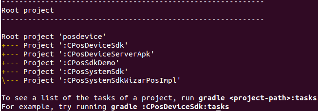

你看，multi projects的情况下，posdevice这个目录对应的build.gradle叫Root Project，它包含5个子Project。

如果你修改settings.gradle，使得include只有一个参数，则gradle projects的子project也会变少，比如图22：


###### 2.  gradle tasks查看任务信息

查看了Project信息，这个还比较简单，直接看settings.gradle也知道。那么Project包含哪些Task信息，怎么看呢？图21,22中最后的输出也告诉你了，想看某个Project包含哪些Task信息，只要执行：

gradle project-path:tasks  就行。注意，project-path是目录名，后面必须跟冒号。

对于Multi-project，在根目录中，需要指定你想看哪个poject的任务。不过你要是已经cd到某个Project的目录了，则不需指定Project-path。

来看图23：

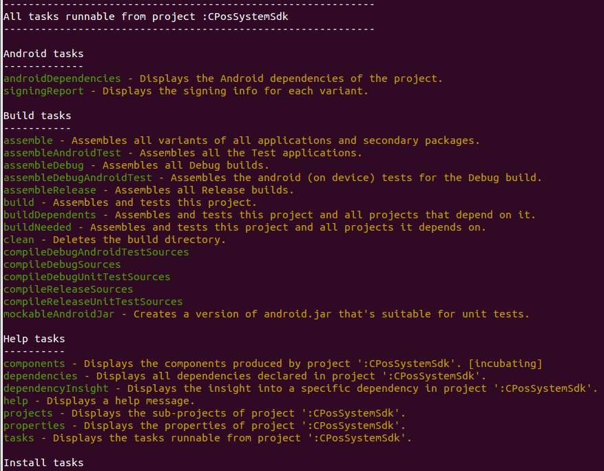

图23是gradle CPosSystemSdk:tasks的结果。

 - cd CPossystemSdk
 - gradle tasks 得到同样的结果

 CPosSystemSdk是一个Android Library工程，Android Library对应的插件定义了好多Task。每种插件定义的Task都不尽相同，这就是所谓的Domain Specific，需要我们对相关领域有比较多的了解。

 这些都是后话，我们以后会详细介绍。

 ###### 3.  gradle task-name执行任务

图23中列出了好多任务，这时候就可以通过 gradle 任务名来执行某个任务。这和make xxx很像。比如：

 - gradle clean是执行清理任务，和make clean类似。
 - gradle properites用来查看所有属性信息。

gradle tasks会列出每个任务的描述，通过描述，我们大概能知道这些任务是干什么的.....。然后gradle task-name执行它就好。

这里要强调一点：Task和Task之间往往是有关系的，这就是所谓的依赖关系。比如，assemble task就依赖其他task先执行，assemble才能完成最终的输出。

依赖关系对我们使用gradle有什么意义呢？

如果知道Task之间的依赖关系，那么开发者就可以添加一些定制化的Task。比如我为assemble添加一个SpecialTest任务，并指定assemble依赖于SpecialTest。当assemble执行的时候，就会先处理完它依赖的task。自然，SpecialTest就会得到执行了...

大家先了解这么多，等后面介绍如何写gradle脚本的时候，这就是调用几个函数的事情，Nothing Special!

#### 4.3  Gradle工作流程

Gradle的工作流程其实蛮简单，用一个图24来表达：


图24告诉我们，Gradle工作包含三个阶段：

 - 首先是初始化阶段。对我们前面的multi-project build而言，就是执行settings.gradle
 - Initiliazation phase的下一个阶段是Configration阶段。
 - Configration阶段的目标是解析每个project中的build.gradle。比如multi-project build例子中，解析每个子目录中的build.gradle。在这两个阶段之间，我们可以加一些定制化的Hook。这当然是通过API来添加的。
 - Configuration阶段完了后，整个build的project以及内部的Task关系就确定了。恩？前面说过，一个Project包含很多Task，每个Task之间有依赖关系。Configuration会建立一个有向图来描述Task之间的依赖关系。所以，我们可以添加一个HOOK，即当Task关系图建立好后，执行一些操作。
 - 最后一个阶段就是执行任务了。当然，任务执行完后，我们还可以加Hook。

 我在：

  - settings.gradle加了一个输出。
  - 在posdevice的build.gradle加了图23中的beforeProject函数。
  - 在CPosSystemSdk加了taskGraph whenReady函数和buidFinished函数。

好了，Hook的代码怎么写，估计你很好奇，而且肯定会埋汰，怎么就还没告诉我怎么写Gradle。马上了！

最后，关于Gradle的工作流程，你只要记住：

 - Gradle有一个初始化流程，这个时候settings.gradle会执行。
 - 在配置阶段，每个Project都会被解析，其内部的任务也会被添加到一个有向图里，用于解决执行过程中的依赖关系。
  - 然后才是执行阶段。你在gradle xxx中指定什么任务，gradle就会将这个xxx任务链上的所有任务全部按依赖顺序执行一遍！

下面来告诉你怎么写代码！

#### 4.4  Gradle编程模型及API实例详解

希望你在进入此节之前，一定花时间把前面内容看一遍！！！

https://docs.gradle.org/current/dsl/  <==这个文档很重要

Gradle基于Groovy，Groovy又基于Java。所以，Gradle执行的时候和Groovy一样，会把脚本转换成Java对象。Gradle主要有三种对象，这三种对象和三种不同的脚本文件对应，在gradle执行的时候，会将脚本转换成对应的对端：

 - Gradle对象：当我们执行gradle xxx或者什么的时候，gradle会从默认的配置脚本中构造出一个Gradle对象。在整个执行过程中，只有这么一个对象。Gradle对象的数据类型就是Gradle。我们一般很少去定制这个默认的配置脚本。
 - Project对象：每一个build.gradle会转换成一个Project对象。
 - Settings对象：显然，每一个settings.gradle都会转换成一个Settings对象。

注意，对于其他gradle文件，除非定义了class，否则会转换成一个实现了Script接口的对象。这一点和3.5节中Groovy的脚本类相似

当我们执行gradle的时候，gradle首先是按顺序解析各个gradle文件。这里边就有所所谓的生命周期的问题，即先解析谁，后解析谁。图27是Gradle文档中对生命周期的介绍：结合上一节的内容，相信大家都能看明白了。现在只需要看红框里的内容：


##### 4.4.1  Gradle对象

我们先来看Gradle对象，它有哪些属性呢？如图26所示：


我在posdevice build.gradle中和settings.gradle中分别加了如下输出：

```groovy
//在settings.gradle中，则输出"In settings,gradle id is"
println "In posdevice, gradle id is " +gradle.hashCode()
println "Home Dir:" + gradle.gradleHomeDir
println "User Home Dir:" + gradle.gradleUserHomeDir
println "Parent: " + gradle.parent
```

得到结果如图27所示：


 - 你看，在settings.gradle和posdevice build.gradle中，我们得到的gradle实例对象的hashCode是一样的（都是791279786）。
 - HomeDir是我在哪个目录存储的gradle可执行程序。
 - User Home Dir：是gradle自己设置的目录，里边存储了一些配置文件，以及编译过程中的缓存文件，生成的类文件，编译中依赖的插件等等。

Gradle的函数接口在文档中也有。

##### 4.4.2  Project对象

每一个build.gradle文件都会转换成一个Project对象。在Gradle术语中，Project对象对应的是Build Script。

Project包含若干Tasks。另外，由于Project对应具体的工程，所以需要为Project加载所需要的插件，比如为Java工程加载Java插件。其实，一个Project包含多少Task往往是插件决定的。

所以，在Project中，我们要：

 - 加载插件。
 - 不同插件有不同的行话，即不同的配置。我们要在Project中配置好，这样插件就知道从哪里读取源文件等
 - 设置属性。


###### 1.  加载插件

Project的API位于 https://docs.gradle.org/current/javadoc/org/gradle/api/Project.html 。加载插件是调用它的apply函数.apply其实是Project实现的PluginAware接口定义的：


来看代码：

[apply函数的用法]

apply是一个函数，此处调用的是图30中最后一个apply函数。注意，Groovy支持函数调用的时候通过  参数名1:参数值2，参数名2：参数值2 的方式来传递参数

```groovy
apply plugin: 'com.android.library'    <==如果是编译Library，则加载此插件

apply plugin: 'com.android.application'  <==如果是编译Android APP，则加载此插件
```

除了加载二进制的插件（上面的插件其实都是下载了对应的jar包，这也是通常意义上我们所理解的插件），还可以加载一个gradle文件。为什么要加载gradle文件呢？

其实这和代码的模块划分有关。一般而言，我会把一些通用的函数放到一个名叫utils.gradle文件里。然后在其他工程的build.gradle来加载这个utils.gradle。这样，通过一些处理，我就可以调用utils.gradle中定义的函数了。

加载utils.gradle插件的代码如下：

utils.gradle是我封装的一个gradle脚本，里边定义了一些方便函数，比如读取AndroidManifest.xml中

的versionName，或者是copy jar包/APK包到指定的目录

```groovy
apply from: rootProject.getRootDir().getAbsolutePath() + "/utils.gradle"
```

也是使用apply的最后一个函数。那么，apply最后一个函数到底支持哪些参数呢？还是得看图29中的API说明：


我这里不遗余力的列出API图片，就是希望大家在写脚本的时候，碰到不会的，一定要去查看API文档！

###### 2.  设置属性

如果是单个脚本，则不需要考虑属性的跨脚本传播，但是Gradle往往包含不止一个build.gradle文件，比如我设置的utils.gradle，settings.gradle。如何在多个脚本中设置属性呢？

Gradle提供了一种名为extra property的方法。extra property是额外属性的意思，在第一次定义该属性的时候需要通过ext前缀来标示它是一个额外的属性。定义好之后，后面的存取就不需要ext前缀了。ext属性支持Project和Gradle对象。即Project和Gradle对象都可以设置ext属性

举个例子：

我在settings.gradle中想为Gradle对象设置一些外置属性，所以在initMinshengGradleEnvironment函数中

```groovy
def initMinshengGradleEnvironment(){
    //属性值从local.properites中读取
    Propertiesproperties = new Properties()
    FilepropertyFile = new File(rootDir.getAbsolutePath() +"/local.properties")
   properties.load(propertyFile.newDataInputStream())
    //gradle就是gradle对象。它默认是Settings和Project的成员变量。可直接获取
   //ext前缀，表明操作的是外置属性。api是一个新的属性名。前面说过，只在
   //第一次定义或者设置它的时候需要ext前缀
    gradle.ext.api =properties.getProperty('sdk.api')

    println gradle.api  //再次存取api的时候，就不需要ext前缀了
    ......
    }
```

再来一个例子强化一下：

我在utils.gradle中定义了一些函数，然后想在其他build.gradle中调用这些函数。那该怎么做呢？

[utils.gradle]

```groovy
//utils.gradle中定义了一个获取AndroidManifests.xmlversionName的函数
def  getVersionNameAdvanced(){
   //下面这行代码中的project是谁？
   defxmlFile = project.file("AndroidManifest.xml")
   defrootManifest = new XmlSlurper().parse(xmlFile)
   returnrootManifest['@android:versionName']
}
//现在，想把这个API输出到各个Project。由于这个utils.gradle会被每一个Project Apply，所以
//我可以把getVersionNameAdvanced定义成一个closure，然后赋值到一个外部属性
  //下面的ext是谁的ext？
ext{ //此段花括号中代码是闭包
    //除了ext.xxx=value这种定义方法外，还可以使用ext{}这种书写方法。
    //ext{}不是ext(Closure)对应的函数调用。但是ext{}中的{}确实是闭包。
    getVersionNameAdvanced = this.&getVersionNameAdvanced
 }
```

上面代码中有两个问题：

 - project是谁？
 - ext是谁的ext？

上面两个问题比较关键，我也是花了很长时间才搞清楚。这两个问题归结到一起，其实就是：

加载utils.gradle的Project对象和utils.gradle本身所代表的Script对象到底有什么关系？

我们在Groovy中也讲过怎么在一个Script中import另外一个Script中定义的类或者函数（见3.5 脚本类、文件I/O和XML操作一节）。在Gradle中，这一块的处理比Groovy要复杂，具体怎么搞我还没完全弄清楚，但是Project和utils.gradle对于的Script的对象的关系是：

 - 当一个Project apply一个gradle文件的时候，这个gradle文件会转换成一个Script对象。这个，相信大家都已经知道了。
 - Script中有一个delegate对象，这个delegate默认是加载（即调用apply）它的Project对象。但是，在apply函数中，有一个from参数，还有一个to参数（参考图31）。通过to参数，你可以把delegate对象指定为别的东西。
 - delegate对象是什么意思？当你在Script中操作一些不是Script自己定义的变量，或者函数时候，gradle会到Script的delegate对象去找，看看有没有定义这些变量或函数。

现在你知道问题1,2和答案了：

 - 问题1：project就是加载utils.gradle的project。由于posdevice有5个project，所以utils.gradle会分别加载到5个project中。所以，getVersionNameAdvanced才不用区分到底是哪个project。反正一个project有一个utils.gradle对应的Script。
 - 问题2：ext：自然就是Project对应的ext了。此处为Project添加了一些closure。那么，在Project中就可以调用getVersionNameAdvanced函数了

 比如：我在posdevice每个build.gradle中都有如下的代码：

 ```groovy
 tasks.getByName("assemble"){
   it.doLast{
       println "$project.name: After assemble, jar libs are copied tolocal repository"
        copyOutput(true)  //copyOutput是utils.gradle输出的closure
     }
}
 ```

通过这种方式，我将一些常用的函数放到utils.gradle中，然后为加载它的Project设置ext属性。最后，Project中就可以调用这种赋值函数了！

注意：此处我研究的还不是很深，而且我个人感觉：

 - 在Java和Groovy中：我们会把常用的函数放到一个辅助类和公共类中，然后在别的地方import并调用它们。
 - 但是在Gradle，更正规的方法是在xxx.gradle中定义插件。然后通过添加Task的方式来完成工作。gradle的user guide有详细介绍如何实现自己的插件。

###### 3.  Task介绍

Task是Gradle中的一种数据类型，它代表了一些要执行或者要干的工作。不同的插件可以添加不同的Task。每一个Task都需要和一个Project关联。

Task的API文档位于 https://docs.gradle.org/current/dsl/org.gradle.api.Task.html 。关于Task，我这里简单介绍下build.gradle中怎么写它，以及Task中一些常见的类型

关于Task。来看下面的例子：

[build.gradle]

```groovy
//Task是和Project关联的，所以，我们要利用Project的task函数来创建一个Task
task myTask  <==myTask是新建Task的名字
task myTask { configure closure }
task myType << { task action } <==注意，<<符号是doLast的缩写
task myTask(type: SomeType)
task myTask(type: SomeType) { configure closure }
```

上述代码中都用了Project的一个函数，名为task，注意：

 - 一个Task包含若干Action。所以，Task有doFirst和doLast两个函数，用于添加需要最先执行的Action和需要和需要最后执行的Action。Action就是一个闭包。
 - Task创建的时候可以指定Type，通过type:名字表达。这是什么意思呢？其实就是告诉Gradle，这个新建的Task对象会从哪个基类Task派生。比如，Gradle本身提供了一些通用的Task，最常见的有Copy 任务。Copy是Gradle中的一个类。当我们：task myTask(type:Copy)的时候，创建的Task就是一个Copy Task。
 - 当我们使用 task myTask{ xxx}的时候。花括号是一个closure。这会导致gradle在创建这个Task之后，返回给用户之前，会先执行closure的内容。
 - 当我们使用task myTask << {xxx}的时候，我们创建了一个Task对象，同时把closure做为一个action加到这个Task的action队列中，并且告诉它“最后才执行这个closure”（注意，<<符号是doLast的代表）。

图30是Project中关于task函数说明：


陆陆续续讲了这么些内容，我自己感觉都有点烦了。是得，Gradle用一整本书来讲都嫌不够呢。

anyway，到目前为止，我介绍的都是一些比较基础的东西，还不是特别多。但是后续例子该涉及到的知识点都有了。下面我们直接上例子。这里有两个例子：

 - posdevice的例子
 - 另外一个是单个project的例子

###### 4.4.3  posdevice实例

现在正是开始通过例子来介绍怎么玩gradle。这里要特别强调一点，根据Gradle的哲学。gradle文件中包含一些所谓的Script Block（姑且这么称它）。Script Block作用是让我们来配置相关的信息。不同的SB有不同的需要配置的东西。这也是我最早说的行话。比如，源码对应的SB，就需要我们配置源码在哪个文件夹里。关于SB，我们后面将见识到！

posdevice是一个multi project。下面包含5个Project。对于这种Project，请大家回想下我们该创建哪些文件？

 - settings.gradle是必不可少的
 - 根目录下的build.gradle。这个我们没讲过，因为posdevice的根目录本身不包含代码，而是包含其他5个子project。
 - 每个project目录下包含对于的build.gradle
 - 另外，我把常用的函数封装到一个名为utils.gradle的脚本里了。

马上一个一个来看它们。

###### 1.  utils.gradle

utils.gradle是我自己加的，为我们团队特意加了一些常见函数。主要代码如下：

[utils.gradle]

```groovy
import groovy.util.XmlSlurper  //解析XML时候要引入这个groovy的package

def copyFile(String srcFile,dstFile){
     ......//拷贝文件函数，用于将最后的生成物拷贝到指定的目录
}
def rmFile(String targetFile){
    .....//删除指定目录中的文件
}

def cleanOutput(boolean bJar = true){
    ....//clean的时候清理
}

def copyOutput(boolean bJar = true){
    ....//copyOutput内部会调用copyFile完成一次build的产出物拷贝
}

def getVersionNameAdvanced(){//老朋友
   defxmlFile = project.file("AndroidManifest.xml")
   defrootManifest = new XmlSlurper().parse(xmlFile)
   returnrootManifest['@android:versionName']
}

//对于android library编译，我会disable所有的debug编译任务
def disableDebugBuild(){
  //project.tasks包含了所有的tasks，下面的findAll是寻找那些名字中带debug的Task。
  //返回值保存到targetTasks容器中
  def targetTasks = project.tasks.findAll{task ->
     task.name.contains("Debug")
  }
  //对满足条件的task，设置它为disable。如此这般，这个Task就不会被执行
 targetTasks.each{
     println"disable debug task  :${it.name}"
    it.setEnabled false
  }
}
//将函数设置为extra属性中去，这样，加载utils.gradle的Project就能调用此文件中定义的函数了
ext{
    copyFile= this.©File
    rmFile =this.&rmFile
   cleanOutput = this.&cleanOutput
   copyOutput = this.©Output
   getVersionNameAdvanced = this.&getVersionNameAdvanced
   disableDebugBuild = this.&disableDebugBuild
}
```

图33展示了被disable的Debug任务的部分信息：

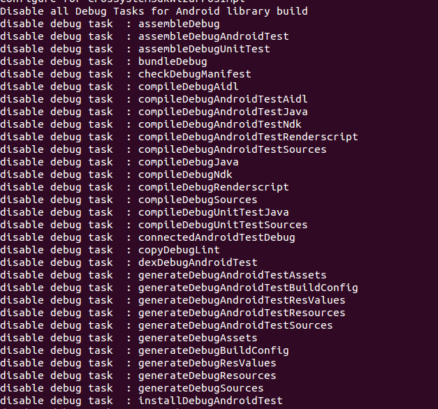

###### 2.  settings.gradle

这个文件中我们该干什么？调用include把需要包含的子Project加进来。代码如下：

[settings.gradle]

```groovy
/*我们团队内部建立的编译环境初始化函数
  这个函数的目的是
  1  解析一个名为local.properties的文件，读取AndroidSDK和NDK的路径
  2  获取最终产出物目录的路径。这样，编译完的apk或者jar包将拷贝到这个最终产出物目录中
  3 获取Android SDK指定编译的版本
*/
def initMinshengGradleEnvironment(){
    println"initialize Minsheng Gradle Environment ....."
   Properties properties = new Properties()
   //local.properites也放在posdevice目录下
    FilepropertyFile = new File(rootDir.getAbsolutePath()+ "/local.properties")
   properties.load(propertyFile.newDataInputStream())
    /*
      根据Project、Gradle生命周期的介绍，settings对象的创建位于具体Project创建之前
      而Gradle底对象已经创建好了。所以，我们把local.properties的信息读出来后，通过
     extra属性的方式设置到gradle对象中
      而具体Project在执行的时候，就可以直接从gradle对象中得到这些属性了！
    */
    gradle.ext.api =properties.getProperty('sdk.api')
    gradle.ext.sdkDir =properties.getProperty('sdk.dir')
     gradle.ext.ndkDir =properties.getProperty('ndk.dir')
     gradle.ext.localDir =properties.getProperty('local.dir')
    //指定debugkeystore文件的位置，debug版apk签名的时候会用到
    gradle.ext.debugKeystore= properties.getProperty('debug.keystore')
     ......
    println"initialize Minsheng Gradle Environment completes..."
}
//初始化
initMinshengGradleEnvironment()
//添加子Project信息
include 'CPosSystemSdk' , 'CPosDeviceSdk' ,'CPosSdkDemo','CPosDeviceServerApk', 'CPosSystemSdkWizarPosImpl'
```

注意，对于Android来说，local.properties文件是必须的，它的内容如下：

[local.properties]

```groovy
local.dir=/home/innost/workspace/minsheng-flat-dir/
//注意，根据Android Gradle的规范，只有下面两个属性是必须的，其余都是我自己加的
sdk.dir=/home/innost/workspace/android-aosp-sdk/
ndk.dir=/home/innost/workspace/android-aosp-ndk/
debug.keystore=/home/innost/workspace/tools/mykeystore.jks
sdk.api=android-19
```

再次强调，sdk.dir和ndk.dir是Android Gradle必须要指定的，其他都是我自己加的属性。当然。不编译ndk，就不需要ndk.dir属性了。

###### 3.  posdevice build.gradle

作为multi-project根目录，一般情况下，它的build.gradle是做一些全局配置。来看我的build.gradle

[posdevice build.gradle]

```groovy
//下面这个subprojects{}就是一个Script Block
subprojects {
  println"Configure for $project.name" //遍历子Project，project变量对应每个子Project
  buildscript {  //这也是一个SB
    repositories {//repositories是一个SB
       ///jcenter是一个函数，表示编译过程中依赖的库，所需的插件可以在jcenter仓库中
       //下载。
       jcenter()
    }
    dependencies { //SB
        //dependencies表示我们编译的时候，依赖android开发的gradle插件。插件对应的
       //class path是com.android.tools.build。版本是1.2.3
        classpath'com.android.tools.build:gradle:1.2.3'
    }
   //为每个子Project加载utils.gradle 。当然，这句话可以放到buildscript花括号之后
   applyfrom: rootProject.getRootDir().getAbsolutePath() + "/utils.gradle"
 }//buildscript结束
}
```

感觉解释得好苍白，SB在Gradle的API文档中也是有的。先来看Gradle定义了哪些SB。如图32所示：


你看，subprojects、dependencies、repositories都是SB。那么SB到底是什么？它是怎么完成所谓配置的呢？

仔细研究，你会发现SB后面都需要跟一个花括号，而花括号，恩，我们感觉里边可能一个Closure。由于图34说，这些SB的Description都有“Configure xxx for this project”，所以很可能subprojects是一个函数，然后其参数是一个Closure。是这样的吗？

Absolutely right。只是这些函数你直接到Project API里不一定能找全。不过要是你好奇心重，不妨到https://docs.gradle.org/current/javadoc/，选择Index这一项，然后ctrl+f，输入图34中任何一个Block，你都会找到对应的函数。比如我替你找了几个API，如图33所示：

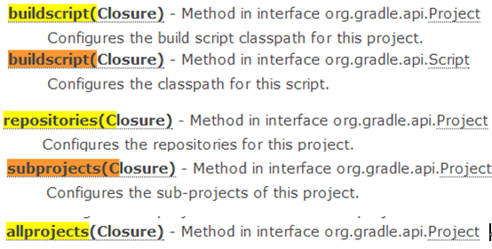

特别提示：当你下次看到一个不认识的SB的时候，就去看API吧。

下面来解释代码中的各个SB：

 - subprojects：它会遍历posdevice中的每个子Project。在它的Closure中，默认参数是子Project对应的Project对象。由于其他SB都在subprojects花括号中，所以相当于对每个Project都配置了一些信息。

 - buildscript：它的closure是在一个类型为ScriptHandler的对象上执行的。主意用来所依赖的classpath等信息。通过查看ScriptHandler API可知，在buildscript SB中，你可以调用ScriptHandler提供的repositories(Closure )、dependencies(Closure)函数。这也是为什么repositories和dependencies两个SB为什么要放在buildscript的花括号中的原因。明白了？这就是所谓的行话，得知道规矩。不知道规矩你就乱了。记不住规矩，又不知道查SDK，那么就彻底抓瞎，只能到网上到处找答案了！
 - 关于repositories和dependencies，大家直接看API吧。后面碰到了具体代码我们再来介绍

###### 4.  CPosDeviceSdk build.gradle

CPosDeviceSdk是一个Android Library。按Google的想法，Android Library编译出来的应该是一个AAR文件。但是我的项目有些特殊，我需要发布CPosDeviceSdk.jar包给其他人使用。jar在编译过程中会生成，但是它不属于Android Library的标准输出。在这种情况下，我需要在编译完成后，主动copy jar包到我自己设计的产出物目录中。

```groovy
//Library工程必须加载此插件。注意，加载了Android插件就不要加载Java插件了。因为Android
//插件本身就是拓展了Java插件
apply plugin: 'com.android.library'
//android的编译，增加了一种新类型的ScriptBlock-->android
android {
       //你看，我在local.properties中设置的API版本号，就可以一次设置，多个Project使用了
      //借助我特意设计的gradle.ext.api属性
       compileSdkVersion =gradle.api  //这两个红色的参数必须设置
       buildToolsVersion  = "22.0.1"
       sourceSets{ //配置源码路径。这个sourceSets是Java插件引入的
       main{ //main：Android也用了
           manifest.srcFile 'AndroidManifest.xml' //这是一个函数，设置manifest.srcFile
           aidl.srcDirs=['src'] //设置aidl文件的目录
           java.srcDirs=['src'] //设置java文件的目录
        }
     }
   dependencies {  //配置依赖关系
      //compile表示编译和运行时候需要的jar包，fileTree是一个函数，
     //dir:'libs'，表示搜索目录的名称是libs。include:['*.jar']，表示搜索目录下满足*.jar名字的jar
     //包都作为依赖jar文件
       compile fileTree(dir: 'libs', include: ['*.jar'])
   }
}  //android SB配置完了
//clean是一个Task的名字，这个Task好像是Java插件（这里是Android插件）引入的。
//dependsOn是一个函数，下面这句话的意思是 clean任务依赖cposCleanTask任务。所以
//当你gradle clean以执行clean Task的时候，cposCleanTask也会执行
clean.dependsOn 'cposCleanTask'
//创建一个Task，
task cposCleanTask() <<{
    cleanOutput(true)  //cleanOutput是utils.gradle中通过extra属性设置的Closure
}
//前面说了，我要把jar包拷贝到指定的目录。对于Android编译，我一般指定gradle assemble
//它默认编译debug和release两种输出。所以，下面这个段代码表示：
//tasks代表一个Projects中的所有Task，是一个容器。getByName表示找到指定名称的任务。
//我这里要找的assemble任务，然后我通过doLast添加了一个Action。这个Action就是copy
//产出物到我设置的目标目录中去
tasks.getByName("assemble"){
   it.doLast{
       println "$project.name: After assemble, jar libs are copied tolocal repository"
        copyOutput(true)
     }
}
/*
  因为我的项目只提供最终的release编译出来的Jar包给其他人，所以不需要编译debug版的东西
  当Project创建完所有任务的有向图后，我通过afterEvaluate函数设置一个回调Closure。在这个回调
  Closure里，我disable了所有Debug的Task
*/
project.afterEvaluate{
    disableDebugBuild()
}
```

Android自己定义了好多ScriptBlock。Android定义的DSL参考文档在
https://developer.android.com/tools/building/plugin-for-gradle.html下载 。注意，它居然没有提供在线文档。

图34所示为Android的DSL参考信息。

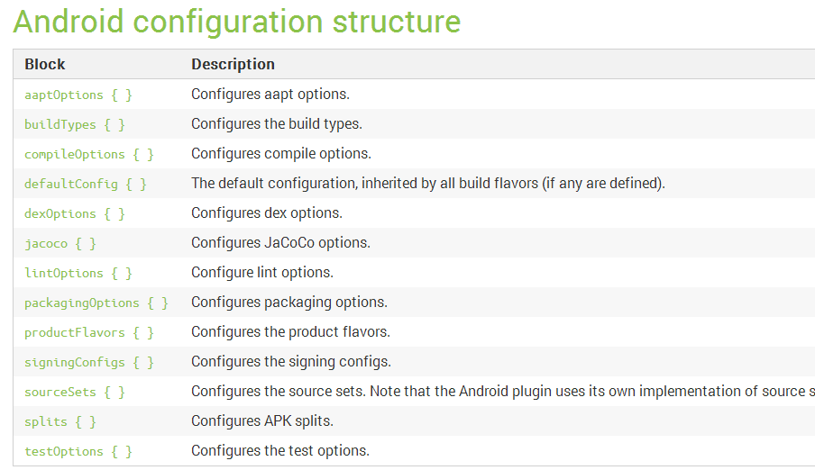

图35为buildToolsVersion和compileSdkVersion的说明：

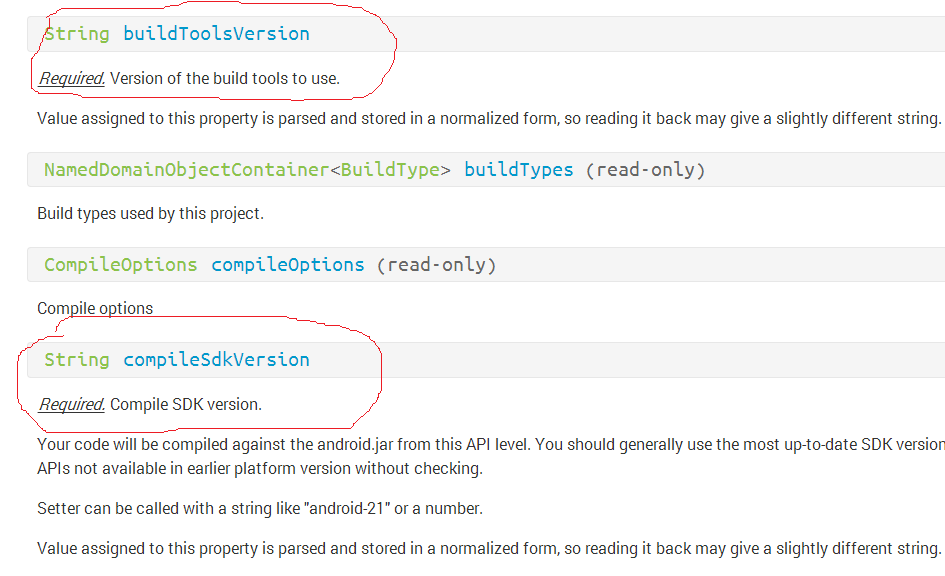

 从图35可知，这两个变量是必须要设置的.....

 ###### 5.  CPosDeviceServerApk build.gradle

 再来看一个APK的build，它包含NDK的编译，并且还要签名。根据项目的需求，我们只能签debug版的，而release版的签名得发布unsigned包给领导签名。另外，CPosDeviceServerAPK依赖CPosDeviceSdk。

虽然我可以先编译CPosDeviceSdk，得到对应的jar包，然后设置CPosDeviceServerApk直接依赖这个jar包就好。但是我更希望CPosDeviceServerApk能直接依赖于CPosDeviceSdk这个工程。这样，整个posdevice可以做到这几个Project的依赖关系是最新的。

[build.gradle]

```groovy
apply plugin: 'com.android.application'  //APK编译必须加载这个插件
android {
      compileSdkVersion gradle.api
      buildToolsVersion "22.0.1"
      sourceSets{  //差不多的设置
       main{
           manifest.srcFile 'AndroidManifest.xml'
          //通过设置jni目录为空，我们可不使用apk插件的jni编译功能。为什么？因为据说
         //APK插件的jni功能好像不是很好使....晕菜
          jni.srcDirs = []
           jniLibs.srcDir 'libs'
            aidl.srcDirs=['src']
           java.srcDirs=['src']
           res.srcDirs=['res']
        }
    }//main结束
   signingConfigs { //设置签名信息配置
       debug {  //如果我们在local.properties设置使用特殊的keystore，则使用它
           //下面这些设置，无非是函数调用....请务必阅读API文档
           if(project.gradle.debugKeystore != null){
              storeFile file("file://${project.gradle.debugKeystore}")
              storePassword "android"
              keyAlias "androiddebugkey"
              keyPassword "android"
           }
        }
   }//signingConfigs结束
     buildTypes {
       debug {
           signingConfig signingConfigs.debug
           jniDebuggable false
        }
    }//buildTypes结束
   dependencies {
        //compile：project函数可指定依赖multi-project中的某个子project
       compile project(':CPosDeviceSdk')
       compile fileTree(dir: 'libs', include: ['*.jar'])
   } //dependices结束
  repositories{
   flatDir {//flatDir：告诉gradle，编译中依赖的jar包存储在dirs指定的目录
           name "minsheng-gradle-local-repository"
            dirsgradle.LOCAL_JAR_OUT //LOCAL_JAR_OUT是我存放编译出来的jar包的位置
   }
  }//repositories结束
}//android结束
/*
   创建一个Task，类型是Exec，这表明它会执行一个命令。我这里让他执行ndk的
   ndk-build命令，用于编译ndk。关于Exec类型的Task，请自行脑补Gradle的API
*/
//注意此处创建task的方法，是直接{}喔，那么它后面的tasks.withType(JavaCompile)
//设置的依赖关系，还有意义吗？Think！如果你能想明白，gradle掌握也就差不多了
task buildNative(type: Exec, description: 'CompileJNI source via NDK') {
       if(project.gradle.ndkDir == null) //看看有没有指定ndk.dir路径
          println "CANNOT Build NDK"
       else{
            commandLine "/${project.gradle.ndkDir}/ndk-build",
               '-C', file('jni').absolutePath,
               '-j', Runtime.runtime.availableProcessors(),
               'all', 'NDK_DEBUG=0'
        }
  }
 tasks.withType(JavaCompile) {
       compileTask -> compileTask.dependsOn buildNative
  }
  ......
 //对于APK，除了拷贝APK文件到指定目录外，我还特意为它们加上了自动版本命名的功能
 tasks.getByName("assemble"){
       it.doLast{
       println "$project.name: After assemble, jar libs are copied tolocal repository"
       project.ext.versionName = android.defaultConfig.versionName
       println "\t versionName = $versionName"
       copyOutput(false)
     }
}
```

###### 6.  结果展示

在posdevice下执行gradle assemble命令，最终的输出文件都会拷贝到我指定的目录，结果如图36所示：

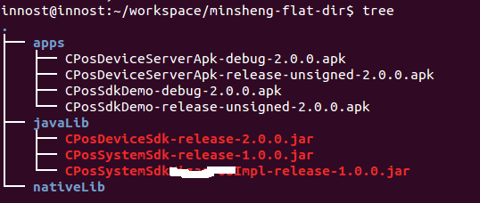

图38所示为posdevice gradle assemble的执行结果：

 - library包都编译release版的，copy到xxx/javaLib目录下
 - apk编译debug和release-unsigned版的，copy到apps目录下
 - 所有产出物都自动从AndroidManifest.xml中提取versionName。

##### 4.4.4  实例2

下面这个实例也是来自一个实际的APP。这个APP对应的是一个单独的Project。但是根据我前面的建议，我会把它改造成支持Multi-Projects Build的样子。即在工程目录下放一个settings.build。

另外，这个app有一个特点。它有三个版本，分别是debug、release和demo。这三个版本对应的代码都完全一样，但是在运行的时候需要从assets/runtime_config文件中读取参数。参数不同，则运行的时候会跳转到debug、release或者demo的逻辑上。

注意：我知道assets/runtime_config这种做法不decent，但，这是一个既有项目，我们只能做小范围的适配，而不是伤筋动骨改用更好的方法。另外，从未来的需求来看，暂时也没有大改的必要。

引入gradle后，我们该如何处理呢？

解决方法是：在编译build、release和demo版本前，在build.gradle中自动设置runtime_config的内容。代码如下所示：

[build.gradle]

```gradle
apply plugin: 'com.android.application'  //加载APP插件
//加载utils.gradle
apply from:rootProject.getRootDir().getAbsolutePath() + "/utils.gradle"
//buildscript设置android app插件的位置
buildscript {
   repositories { jcenter() }
   dependencies { classpath 'com.android.tools.build:gradle:1.2.3' }
}
//androidScriptBlock
android {
   compileSdkVersion gradle.api
   buildToolsVersion "22.0.1"
   sourceSets{//源码设置SB
        main{
           manifest.srcFile 'AndroidManifest.xml'
           jni.srcDirs = []
           jniLibs.srcDir 'libs'
           aidl.srcDirs=['src']
           java.srcDirs=['src']
           res.srcDirs=['res']
           assets.srcDirs = ['assets'] //多了一个assets目录
        }
    }
   signingConfigs {//签名设置
       debug {  //debug对应的SB。注意
           if(project.gradle.debugKeystore != null){
               storeFile file("file://${project.gradle.debugKeystore}")
               storePassword "android"
               keyAlias "androiddebugkey"
               keyPassword "android"
           }
        }
    }
    /*
     最关键的内容来了： buildTypesScriptBlock.
     buildTypes和上面的signingConfigs，当我们在build.gradle中通过{}配置它的时候，
     其背后的所代表的对象是NamedDomainObjectContainer<BuildType> 和
     NamedDomainObjectContainer<SigningConfig>
     注意，NamedDomainObjectContainer<BuildType/或者SigningConfig>是一种容器，
     容器的元素是BuildType或者SigningConfig。我们在debug{}要填充BuildType或者
    SigningConfig所包的元素，比如storePassword就是SigningConfig类的成员。而proguardFile等
    是BuildType的成员。
    那么，为什么要使用NamedDomainObjectContainer这种数据结构呢？因为往这种容器里
    添加元素可以采用这样的方法： 比如signingConfig为例
    signingConfig{//这是一个NamedDomainObjectContainer<SigningConfig>
       test1{//新建一个名为test1的SigningConfig元素，然后添加到容器里
         //在这个花括号中设置SigningConfig的成员变量的值
       }
      test2{//新建一个名为test2的SigningConfig元素，然后添加到容器里
         //在这个花括号中设置SigningConfig的成员变量的值
      }
    }
    在buildTypes中，Android默认为这几个NamedDomainObjectContainer添加了
    debug和release对应的对象。如果我们再添加别的名字的东西，那么gradleassemble的时候
    也会编译这个名字的apk出来。比如，我添加一个名为test的buildTypes，那么gradle assemble
    就会编译一个xxx-test-yy.apk。在此，test就好像debug、release一样。
   */
   buildTypes{
        debug{ //修改debug的signingConfig为signingConfig.debug配置
           signingConfig signingConfigs.debug
        }
        demo{ //demo版需要混淆
           proguardFile 'proguard-project.txt'
           signingConfig signingConfigs.debug
        }
       //release版没有设置，所以默认没有签名，没有混淆
    }
      ......//其他和posdevice 类似的处理。来看如何动态生成runtime_config文件
   def  runtime_config_file = 'assets/runtime_config'
   /*
   我们在gradle解析完整个任务之后，找到对应的Task，然后在里边添加一个doFirst Action
   这样能确保编译开始的时候，我们就把runtime_config文件准备好了。
   注意，必须在afterEvaluate里边才能做，否则gradle没有建立完任务有向图，你是找不到
   什么preDebugBuild之类的任务的
   */
   project.afterEvaluate{
      //找到preDebugBuild任务，然后添加一个Action
      tasks.getByName("preDebugBuild"){
           it.doFirst{
               println "generate debug configuration for ${project.name}"
               def configFile = new File(runtime_config_file)
               configFile.withOutputStream{os->
                   os << I am Debug\n'  //往配置文件里写 I am Debug
                }
           }
        }
       //找到preReleaseBuild任务
       tasks.getByName("preReleaseBuild"){
           it.doFirst{
               println "generate release configuration for ${project.name}"
               def configFile = new File(runtime_config_file)
               configFile.withOutputStream{os->
                   os << I am release\n'
               }
           }
        }
       //找到preDemoBuild。这个任务明显是因为我们在buildType里添加了一个demo的元素
      //所以Android APP插件自动为我们生成的
       tasks.getByName("preDemoBuild"){
           it.doFirst{
               println "generate offlinedemo configuration for${project.name}"
               def configFile = new File(runtime_config_file)
               configFile.withOutputStream{os->
                   os << I am Demo\n'
               }
            }
        }
    }
}
 .....//copyOutput
```

最终的结果如图37所示：


几个问题，为什么我知道有preXXXBuild这样的任务？

答案：gradle tasks --all查看所有任务。然后，多尝试几次，直到成功

## 五、总结

到此，我个人觉得Gradle相关的内容都讲完了。很难相信我仅花了1个小时不到的时间就为实例2添加了gradle编译支持。在一周以前，我还觉得这是个心病。回想学习gradle的一个月时间里，走过不少弯路，求解问题的思路也和最开始不一样：

 - 最开始的时候，我一直把gradle当做脚本看。然后到处到网上找怎么配置gradle。可能能编译成功，但是完全不知道为什么。比如NameDomainObjectContainer，为什么有debug、release。能自己加别的吗？不知道怎么加，没有章法，没有参考。出了问题只能google，找到一个解法，试一试，成功就不管。这么搞，心里不踏实。
 - 另外，对语法不熟悉，尤其是Groovy语法，虽然看了下快速教材，但总感觉一到gradle就看不懂。主要问题还是闭包，比如Groovy那一节写得文件拷贝的例子中的withOutputStream，还有gradle中的withType，都是些啥玩意啊？
 - 所以后来下决心先把Groovy学会，主要是把自己暴露在闭包里边。另外，Groovy是一门语言，总得有SDK说明吧。写了几个例子，慢慢体会到Groovy的好处，也熟悉Groovy的语法了。
 - 接着开始看Gradle。Gradle有几本书，我看过Gradle in Action。说实话，看得非常痛苦。现在想起来，Gradle其实比较简单，知道它的生命周期，知道它怎么解析脚本，知道它的API，几乎很快就能干活。而Gradle In Action一上来就很细，而且没有从API角度介绍。说个很有趣的事情，书中有个类似下面的例子

```groovy
task myTask  <<  {
   println ' I am myTask'
}
```

书中说，如果代码没有加<<，则这个任务在脚本initialization（也就是你无论执行什么任务，这个任务都会被执行，I am myTask都会被输出）的时候执行，如果加了<<，则在gradle myTask后才执行。

我开始完全不知道为什么，死记硬背。现在你明白了吗？？？？

这和我们调用task这个函数的方式有关！如果没有<<，则闭包在task函数返回前会执行，而如果加了<<，则变成调用myTask.doLast添加一个Action了，自然它会等到grdle myTask的时候才会执行！

现在想起这个事情我还是很愤怒，API都说很清楚了......而且，如果你把Gradle当做编程框架来看，对于我们这些程序员来说，写这几百行代码，那还算是事嘛？？
