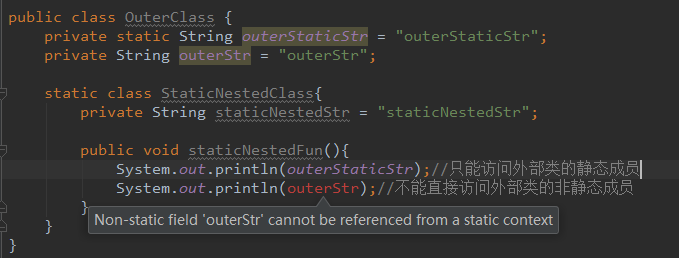

# 静态嵌套类（static nested class）和内部类（Inner class）

## 什么是嵌套类及内部类？

可以在一个类的内部定义另一个类，这种类称为嵌套类（nested classes），它有两种类型：静态嵌套类和非静态嵌套类。非静态嵌套类，也被称作为内部类（Inner class）。

其中内部类（Inner class）又可分为三种：
 1. 在一个类（外部类）中直接定义的内部类；
 2. 在一个方法（外部类方法）中定义的内部类；
 3. 匿名内部类

## 静态嵌套类（static nested class）

静态嵌套类不可访问外部类的非静态成员，只能访问外部类的静态成员:



在静态嵌套类内部不能直接访问外部类的非静态成员，这是由 Java 语法中“静态方法不能直接访问非静态成员”所限定，若想访问外部类的成员，必须通过其他方式解决。外部类不能直接访问内部类的成员，可以通过内部类的实例来访问，并且能够访问内部类的 `privite` 成员与方法。
```java
public class OuterClass {
    private static String outerStaticStr = "outerStaticStr";
    private String outerStr = "outerStr";

    static class StaticNestedClass{
        public String staticNestedStr = "staticNestedStr";

        public void staticNestedFun(){
            System.out.println(outerStaticStr);//只能访问外部类的静态成员
//            System.out.println(outerStr);//不能直接访问外部类的非静态成员
        }
    }

    public void outerFun(){
        StaticNestedClass staticNestedClass = new StaticNestedClass();
        System.out.println(staticNestedClass.staticNestedStr);
    }
}
```
在其他类中创建静态嵌套类和内部类的实例也有所区别：
```java
public class OuterClass {

    static class StaticNestedClass{

    }

    class InnerClass{

    }
}

OuterClass.StaticNestedClass staticNestedClass = new OuterClass.StaticNestedClass();
OuterClass.InnerClass innerClass = new OuterClass().new InnerClass();
```
